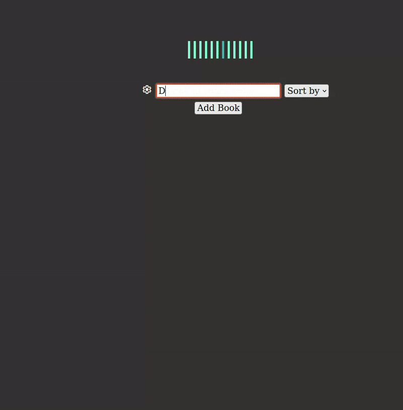

 
<h1>Minimalist Library</h1>
<h2><em>Books Books Books</em></h2>

 

## Features

- Pure Typescript SPA
- Persistent storage using LocalStorage
- Google Books API import
- Dynamically loaded search results for book addition (Uses Tagify Library)
- Minimalist layout based on real book stands with ability to sort by multiple parameters (Styling was NOT the focus on this project)
- Multiple library management
- Fluent libraries / Books addition and removal
- OOP design that conveniently and easily links data objects with DOM nodes
- Esbuild bundle

## Showcase 

Project assignment from [The Odin Project](https://www.theodinproject.com/lessons/node-path-javascript-library)

## License

Licensed under [Creative Commons Attribution 4.0 International Public License](https://creativecommons.org/licenses/by/4.0/)

## Learnt

- Do not build a feature (in this case was a function to retrieve the house object internals from URLsearchParams) without having finished the actual object it consumes 

## to-do

- Add interval time limit to Google API calls 

## leftovers

- add ability to log custom books
- integrate imgur for img hosting for custom book covers
- integrate github gist's as a quirky api of house obj data. Using gist's id's for posting an retrieving house obj data, in conjunction with URLsearchParams for building extraction of data with no backend required for free
- clipboard api for importing and exporting URLparams

